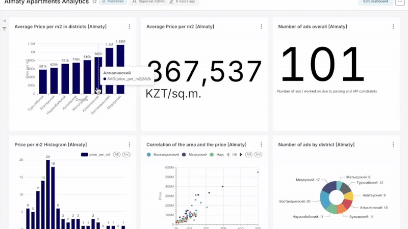

This repo contains step-by-step pipeline to analyze the real estate ads in Almaty, Kazakhstan. The dataset was collected from [Krisha](https://www.krisha.kz/) (Kazakhstan’s largest real estate platform) and visualized using [Apache Superset](https://superset.apache.org/). 

To install dependencies, run `pip install requests beautifulsoup4 lxml pandas tqdm` and `pip install geopy tqdm`.

##    Stack

 Python - data scraping and preprocessing

 BeautifulSoup, Pandas - web parsing and data cleaning

PostgreSQL - storage and queries

Apache Superset - interactive dashboard (I used **Docker** to run Apache Superset locally, as it provides an isolated environment and makes setup significantly easier)

## **Project Workflow**

1. Data Collection: scraped apartment listings from [krisha.kz](https://www.krisha.kz/) including titles, prices, locations, link, and apartment features (number of rooms and area in m2) 

2. Data Cleaning & Preparation: converted raw listings to structured CSV, parsed latitude and longitude, calculated `price_per_m2`, retrieved `district` via adresses. 

3. Visualization in Superset using interactive dashboard with multiple chart types (see `/dashboard_apache_superset.jpg` for a snapshot)
   
--------------------------------------------------------------------------------

&nbsp;&nbsp;&nbsp;&nbsp; During the project, I faced some challenges:

1. Web Scraping limitations. It was not feasible to send too many requests or parse hundreds of pages, since [krisha.kz](https://www.krisha.kz/) could temporarily block the IP. Not to trigger the limit, I decided around 100 listings were sufficient for practice.

2. Incorrect area extraction. The regex pattern `r"(\d+)\s*м²"` sometimes captured the wrong numbers (e.g., floor values) instead of the actual apartment area. This caused my `price_per_m2` formula to miscalculate in some cases. To fix it, I refined the parsing logic to target only the number preceding “м²”, ignore fractions, and filter unrealistic areas (e.g., `area_m2 < 10` is not a real area).

3. Geocoding limitations. To visualize listings on a map, I had to geocode addresses == convert them into `latitude` and `longitude`. I used the **Google Maps Geocoding API**, but it also has daily request limits, which required caching.

## **How to Reproduce** 

1. Clone the repository
   
    >git clone https://github.com/<your_username>/almaty-apartments-analytics.git
   
    >cd almaty-apartments-analytics
3. Load data into Superset (via Upload CSV to database)
4. Import the dashboard JSON (if provided)
5. Explore the visualizations interactively

## **Interactive Dashboard Import**

You can explore the interactive version of this dashboard directly in Apache Superset by importing the provided `dashboard_for_import.zip` file.
1. Open your Superset instance. Settings → Import Dashboards.

2. Upload `dashboard_for_import.zip`.

3. Superset will automatically create the charts. Then, you will see the “Almaty Apartments Analytics” dashboard in your list of dashboards. Note that you must have Superset version >= 2.0.

Feel free to contact me via [Telegram](https://t.me/a117sst) or email anel.salmenova@gmail.com.
